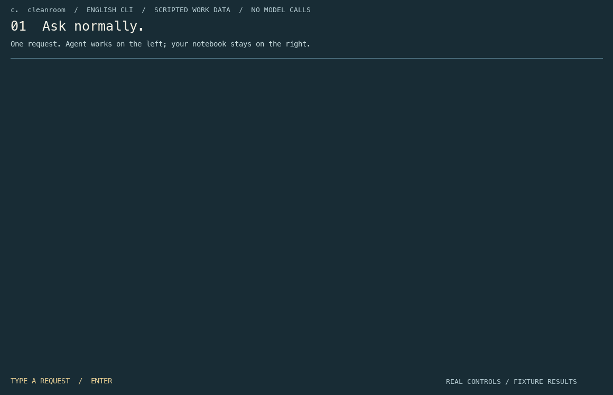

<a id="top"></a>

<p align="center"></p>

<h3 align="center">Build with AI. Keep the experience.</h3>

<p align="center">A coding workspace. A learning notebook. Your own growing skills.</p>

<p align="center"><a href="https://verantyx.ai/#play">Try in your browser</a> · <a href="#install">Install</a> · <a href="#first-minute">First-minute tutorial</a> · <a href="docs/two-pane-interaction.md">Controls</a> · <a href="LICENSE">MIT</a></p>

<p align="center"><a href="#en">English</a> · <a href="#ja">日本語</a> · <a href="#zh-Hans">简体中文</a> · <a href="#ko">한국어</a> · <a href="#es">Español</a></p>



<p align="center"><strong>Ask normally. Keep what matters. Learn at your pace.</strong></p>

Recorded CLI walkthrough with scripted work data. It may predate the latest controls;
use the built-in tutorial for the current interaction. This is not a live-model benchmark.
[Watch with controls](public/cleanroom/cli-demo.mp4) · [Static view](public/cleanroom/cli-demo-poster.png) · [Recording recipe](docs/DEMO_RECORDING.md)

---

<a id="en"></a>

## English

### Build with AI. Keep the experience.

A coding workspace, a learning notebook and a personal skills map that grow with your projects. Ask normally; keep the decisions, explanations and experience that matter to you.

Built on Vera Kernel, Cleanroom keeps project purpose, design decisions, verification methods, failures and technical understanding with the human while AI does most of the implementation. It is also a dictionary of what you want to understand later and what you choose to reference or delegate, plus a journal that connects those choices across projects.

<a id="install"></a>

### Start locally

Python **3.11+** · macOS / Linux · Windows: **WSL2**. CLI: `verantyx`.

```sh
git clone https://github.com/Ag3497120/cleanroom.git cleanroom
cd cleanroom
python3 -m venv .venv
source .venv/bin/activate
python -m pip install -e ./core
verantyx setup
verantyx
```

[Operating guide](core/docs/OPERATIONS.en.md) · [Commands](#commands) · [Try the workspace](https://verantyx.ai/#play)

<a id="first-minute"></a>

Already installed? In your checkout, activate the virtual environment, run `git pull --ff-only` and `python -m pip install -e ./core`, then restart the CLI. Reinstalling dependencies is needed for the new PDF/image support.

### Your first minute

1. Run `verantyx setup`. Choose your language and AI connection with the arrow keys; the highlighted option explains its effect. Official CLI accounts, local Ollama models and API connections are configured here.
2. When you leave the settings menu for the first time, press Enter to try the simulated split-screen tutorial. It makes no model calls and does not save practice inputs as work, notes or learning. A small-terminal advisory never blocks you.
3. Run `verantyx` and ask normally. The active input has a strong outline; the configured model stays visible, and model answers are separate from system activity.

Replay the practice at any time with `verantyx tutorial`, or `/tutorial` inside Agent. Use `/model` for inline model settings, `/verantyx` for other settings and `/help` for available actions. Settings stay inside the Agent pane; text without a slash returns to ordinary work.

| Key | What happens |
|---|---|
| Enter with text | Send the request, unless a completion or settings choice is open |
| Empty Enter | Agent → yellow Owner memo → green Owner search → Agent |
| Shift+Enter | New line on supporting terminals; Alt+Enter or Ctrl+J is the fallback |
| Up / Down | Recall earlier input and restore your draft; in multiline text, at the first / last line |
| Prefix + arrows + Tab | Pick an Owner reference and insert it into the request |

Completion and settings choices take priority over history. Each input has its own session history; slash commands and temporary chat are excluded. If your terminal sends Shift+Enter as plain Enter, use the fallback rather than relying on Shift.

**Bring a document:** `/attach "/path/to/file.pdf"` or an image, then confirm the send scope. PDF page images require a vision-capable model; `--text` extracts text only and `--pages 1-3` selects pages. External harness attachments are not supported yet.

**Talk without adding to your notebook:** `//your question` opens temporary, tool-free chat. Cleanroom does not save it as work, journal entries, skills or learning memory; the model provider's retention policy is separate.

[Split-pane guide and privacy limits](docs/two-pane-interaction.md#english) · [All commands](#commands)

### What makes it different

| | |
|---|---|
| **Make things together** | Work in Agent. Keep purpose, decisions, assumptions, receipts and unknowns in Owner without writing a second report. |
| **Learn only what you choose** | Start with your own experience and goals. Choose the amount, weight and timing of suggestions. Next time is a bookmark, not overdue homework. |
| **Grow a personal record** | Save explanations while work happens. Keep the full detail, explore it later, and build an experience journal and skills map across projects. |

For a Flask app, you might explore request handling next time, keep API details as reference and delegate repetitive forms. The suggestion follows the recorded work and your goals, not the word Flask.

AI procedures and your skills are separate. An imported or generated procedure starts as a draft; it does not mean you learned it, approve it, or grant it permission. Your optional skills board records only the experiences you choose to describe. No score, streak or requirement to fill every space.

### Your pace, not a curriculum

A voluntary profile, editable whenever you want. Asking AI to push to GitHub, skipping a lesson or choosing automation is not evidence of inability. A new primary technology can be added later, without an exhaustive first-run questionnaire.

<details>
<summary><strong>Controls, privacy and origins</strong></summary>

### Split CLI: Agent on the left, Owner on the right

- Ask in the lower-left Agent field. No new command language to learn.
- Empty Enter moves to the yellow Owner memo, then the green Owner search, then back to Agent.
- Type at least the first two characters of an Owner item, choose with Up/Down, and press Tab to insert that reference. Enter selects an open suggestion, rather than sending the task.
- F2 opens actions; F3 scrolls; F4 opens learning; Alt+0 restores the split. Ctrl+J adds a line. Ctrl+D closes at a safe boundary.

### What stays with you

- Purpose and design choices, with their reasons
- Actual checks, AI assumptions, failures and unknowns kept distinct
- Implementation-time explanations, not just a final summary
- Your chosen learning, reference and delegation bookmarks
- A private experience journal and skills map across projects

Work results and AI reflection are independent. Different models can offer different interpretations without erasing previous ones. AI procedure drafts are not proof that you have learned a skill. Skipping, delegating, or asking for help is not an ability judgment.

Owner notes and search do not call AI. Explicitly inserted references enter the request's send scope. Private project and personal records are not meant for public GitHub commits.

The name comes from the author's personal image of a cleanroom: an isolated sanctuary for human judgment. It is a metaphor, not an OS sandbox guarantee. This independently developed, non-commercially motivated project grew from a Japanese X post and the author's own unease about losing the experience of making things with AI.

MIT licensed. Personal, non-commercial motivation is not a restriction on commercial use.

> Source preview, not a certification of MVP completeness. The GIF uses scripted fixtures in the real CLI renderer; it is not a successful model benchmark. The browser playground is an in-memory interaction demo, not a remote shell.

</details>

[↑ Languages](#top)


<a id="ja"></a>

## 日本語

### AIと作る。その経験を、自分のものに。

共同開発の作業台と、必要な分だけ学ぶ辞書、プロジェクトを越えて育つ自分のスキルノート。普通に依頼するだけで、判断・説明・経験が手元につながります。

Vera Kernelを基盤に、AIが実装の大部分を担っても、目的、設計判断、検証方法、失敗、技術的理解を人間側に残します。それだけでなく、後で身につけたいことと、参照・自動化に任せることを分ける辞書、それらをプロジェクトを越えて積み重ねる日記でもあります。

### 手元で始める

Python **3.11+** · macOS / Linux · Windows: **WSL2**. CLI: `verantyx`.

```sh
git clone https://github.com/Ag3497120/cleanroom.git cleanroom
cd cleanroom
python3 -m venv .venv
source .venv/bin/activate
python -m pip install -e ./core
verantyx setup
verantyx
```

[操作ガイド](core/docs/OPERATIONS.ja.md) · [Commands](#commands) · [この場で操作を試す](https://verantyx.ai/#play)

導入済みの場合は、リポジトリ内で仮想環境を有効にし、`git pull --ff-only`と`python -m pip install -e ./core`を実行してCLIを再起動します。PDF・画像対応の追加依存を入れるため、ソース更新だけでなく再インストールも必要です。

### 最初の1分

1. `verantyx setup`で言語とAI接続を選びます。矢印キーで選択すると、その項目の説明が表示されます。公式CLIのアカウント、ローカルのOllamaモデル、API接続をここから設定できます。
2. 初めて設定メニューを閉じたら、Enterで二分割画面の操作練習へ進めます。モデルは呼び出さず、練習入力は仕事・メモ・学習記憶へ保存しません。ターミナルが小さくても案内だけで、操作を止めません。
3. `verantyx`を起動して普通に依頼します。操作中の入力欄は太い枠で、設定中のモデルはヘッダーで確認できます。モデルの回答とシステム通知は別の欄に表示します。

練習は`verantyx tutorial`、起動中なら`/tutorial`で再開できます。`/model`はモデル設定、`/verantyx`はその他の設定、`/help`は操作案内です。設定はAgent欄の中に表示され、`/`を付けずに文章を入力すると通常の依頼に戻ります。

| キー | 動作 |
|---|---|
| 文章付きのEnter | 送信。補完候補・設定の選択中は、その選択を優先 |
| 空欄のEnter | Agent → 黄色のOwnerメモ → 緑色のOwner検索 → Agent |
| Shift+Enter | 対応端末で改行。区別できない端末ではAlt+EnterまたはCtrl+J |
| ↑ / ↓ | 以前の入力を呼び出し、下書きへ戻る。複数行では先頭行・最終行で操作 |
| 項目の先頭文字 + 矢印 + Tab | Ownerの参照を選び、依頼へ挿入 |

補完候補や設定の選択中は、履歴より選択を優先します。履歴は入力欄ごと・セッション内だけに分け、設定コマンドや一時対話は含めません。端末がShift+EnterとEnterを同じ信号で送る場合は、代替キーを使ってください。

**資料も一緒に:** `/attach "/path/to/file.pdf"`や画像を添付し、送信範囲を確認します。PDFのページ画像には視覚対応モデルが必要です。`--text`で本文だけ、`--pages 1-3`でページ指定ができます。外部ハーネス経由の添付は未対応です。

**ノートに残さず相談:** `//相談内容`はツールを使わない一時対話です。Cleanroomの仕事・日記・スキル・学習記憶には残しません。接続先サービス側の保存方針は別です。

[二分割画面の操作とプライバシー](docs/two-pane-interaction.md#日本語) · [コマンド一覧](#commands)

### 何が違うのか

| | |
|---|---|
| **一緒に作る** | Agentで仕事を進め、Ownerに目的・判断・仮定・検査記録・不明点を残す。人間が別の報告書を作る必要はありません。 |
| **必要な分だけ学ぶ** | 本人の経験と学びたいことを起点に、提案の量・重さ・タイミングを選ぶ。「次回に回す」はしおりであって、未提出の宿題ではありません。 |
| **自分の経験を育てる** | 実装中の説明を細かいまま保存し、後から要約や紐解き解説へ。日記とスキルの地図が次のプロジェクトにも続きます。 |

Flaskアプリなら、リクエスト処理は次回少し学ぶ、個別APIは参照に残す、定型フォームは委譲する。技術名だけで決めず、実際の作業と本人の希望に沿って提案します。

AIの手順と本人のスキルは別です。生成・移植された手順は候補であり、習得・承認・実行権限を意味しません。任意のスキル盤面には、本人が残したい経験だけを記録します。点数、連続日数、全てを埋める義務はありません。

### カリキュラムではなく、自分のペース

プロフィールは任意の自己申告で、いつでも更新できます。GitHubへのプッシュを頼むこと、学習のスキップ、自動化を選ぶことから能力不足を推定しません。新しい主要技術は後から追記でき、初回に全てを答える必要はありません。

<details>
<summary><strong>操作・プライバシー・制作の背景</strong></summary>

### 左はAgent、右はOwner

- 左下のAgent欄へ普通の文章で依頼します。独自のコマンドを覚える必要はありません。
- 空欄でEnterを押すと、Agent → 黄色のOwnerメモ → 緑色のOwner検索 → Agentを巡回します。
- Owner項目の先頭2文字以上を入力し、上下矢印で選び、Tabで参照を挿入します。補完候補が開いている間のEnterは選択だけで、依頼は送りません。
- F2は操作一覧、F3はスクロール、F4は理解の画面、Alt+0は分割表示。Ctrl+Jで改行し、Ctrl+Dで操作の区切りに終了します。

### 仕事の後、手元に残るもの

- 目的・設計判断と、その選択理由
- 検査記録・AIの仮定・失敗・不明点を区別した記録
- 完成後の要約だけでない、実装途中の詳しい説明
- 自分で選ぶ、学習・参照・委譲のしおり
- プロジェクトを越えて続く、自分の経験日記とスキルの地図

作業結果とAIによる整理は別状態です。モデルごとの見方が違っても過去の整理を消しません。AIの手順が保存されたことを、本人の習得とは数えません。スキップ、委譲、相談を理解不足と推定しません。

Ownerのメモと検索だけではAIを呼びません。依頼に明示的に挿入した参照は送信範囲に入ります。プロジェクトと個人の私的な記録を公開GitHubへ追加しないでください。

私は日本語の「クリーンルーム」に、隔離された聖域のような、人間の判断が守られる場所を重ねて、このプロジェクトを始めました。これは私自身の比喩であり、一般的な語義やOSの隔離保証ではありません。ある日本語のX投稿と、AIを使う最近の開発や将来への不安が出発点です。

MITライセンス。個人的な非商用の制作動機は、商用利用を制限するものではありません。

> ソース版のプレビューであり、MVP全項目の合格宣言ではありません。GIFは実際のCLI描画に台本付きのデモデータを流したものです。実モデルの成功記録ではありません。Webの体験欄はメモリ内だけの操作デモで、リモートシェルではありません。

</details>

[↑ Languages](#top)


<a id="zh-Hans"></a>

## 简体中文

### 与 AI 一起创造，把经验留给自己。

协作开发工作台、按需学习词典，以及跨项目积累的个人技能笔记。照常提出任务，把对你重要的判断、解释和经验留在手中。

Cleanroom 基于 Vera Kernel。当 AI 承担大部分实现时，项目目标、设计判断、验证方法、失败经验和技术理解仍由人保有。它也是一本区分日后想掌握、只需查阅和可以委托的词典，以及连接不同项目的成长日记。

### 在本机开始

Python **3.11+** · macOS / Linux · Windows: **WSL2**. CLI: `verantyx`.

```sh
git clone https://github.com/Ag3497120/cleanroom.git cleanroom
cd cleanroom
python3 -m venv .venv
source .venv/bin/activate
python -m pip install -e ./core
verantyx setup
verantyx
```

[操作指南](core/docs/OPERATIONS.zh-Hans.md) · [Commands](#commands) · [体验工作台](https://verantyx.ai/#play)

已安装？在仓库中激活虚拟环境，运行 `git pull --ff-only` 和 `python -m pip install -e ./core`，然后重启 CLI。新的 PDF／图片支持需要安装新增依赖。

### 第一分钟

1. 运行 `verantyx setup`，用方向键选择语言和 AI 连接。当前选项会显示说明，可配置官方 CLI 账号、本地 Ollama 模型或 API。
2. 首次退出设置菜单时，按 Enter 进入分屏操作练习。练习不会调用模型，也不会把输入保存为工作、笔记或学习记录。终端较小时只提示，不阻止继续。
3. 运行 `verantyx`，像平常一样提出任务。粗边框标出当前输入区域，页眉显示配置的模型，模型回答与系统通知分开显示。

随时用 `verantyx tutorial` 或 Agent 内的 `/tutorial` 重放练习。`/model` 打开模型设置，`/verantyx` 打开其他设置，`/help` 显示操作说明。设置留在 Agent 区域中，不加 `/` 输入普通文字即可回到正常任务。

| 按键 | 动作 |
|---|---|
| 有文字时 Enter | 发送；补全候选或设置选项打开时优先选择 |
| 空输入框 Enter | Agent → 黄色 Owner 备忘 → 绿色 Owner 搜索 → Agent |
| Shift+Enter | 支持的终端中换行；也可用 Alt+Enter 或 Ctrl+J |
| ↑ / ↓ | 查看之前的输入并恢复草稿；多行文字在首行／末行触发 |
| 条目前缀 + 方向键 + Tab | 选择 Owner 引用并插入请求 |

补全和设置选择优先于历史。各输入框的历史仅保留在当前会话中，不包括设置命令与临时对话。若终端无法区分 Shift+Enter 和 Enter，请使用替代按键。

**附上资料：**用 `/attach "/path/to/file.pdf"` 添加 PDF 或图片，并确认发送范围。PDF 页面图像需要视觉模型；`--text` 只提取文字，`--pages 1-3` 选择页面。暂不支持经外部 harness 发送附件。

**不加入笔记的咨询：**`//问题` 是不使用工具的临时对话，不保存为 Cleanroom 的工作、日记、技能或学习记忆。模型服务商的留存政策另行适用。

[分屏操作与隐私说明](docs/two-pane-interaction.md#简体中文) · [命令列表](#commands)

### 不同之处

| | |
|---|---|
| **一起创造** | 在 Agent 中推进工作，在 Owner 中保留目标、判断、假设、验证记录与未知事项，无需另写报告。 |
| **只学自己选择的部分** | 以自己的经验和目标为起点，选择建议的数量、深度和时机。“下次再看”是书签，不是逾期作业。 |
| **积累个人经验** | 在实现过程中保存细节，之后选择摘要或展开解释。日记和技能地图随项目一起成长。 |

开发 Flask 应用时，可以下次学习请求处理，将具体 API 留作参考，把重复表单委托给 AI。建议来自实际工作和个人目标，而非技术名称。

AI 的操作步骤与人的技能是两回事。导入或生成的步骤先作为草稿保存，不代表本人已掌握、已批准或授予执行权限。技能面板只记录你选择描述的经验，没有分数、连续打卡或填满要求。

### 自己的节奏，而非固定课程

经验档案是自愿的自述，可随时修改。委托 GitHub 推送、跳过学习或选择自动化不表示能力不足。新的主要技术可之后补充，无需首次回答一切。

<details>
<summary><strong>操作、隐私与起源</strong></summary>

### 左侧 Agent，右侧 Owner

- 在左下方 Agent 输入框用自然语言提出任务，无需记住新命令。
- 在空输入框按 Enter，依次切换：Agent → 黄色 Owner 备忘 → 绿色 Owner 搜索 → Agent。
- 输入 Owner 条目的前两个或更多字符，用上下方向键选择，再按 Tab 插入引用。候选列表打开时，Enter 只选择候选，不提交任务。
- F2 打开操作菜单，F3 滚动，F4 打开理解视图，Alt+0 返回分屏。Ctrl+J 换行，Ctrl+D 在安全的操作边界退出。

### 工作完成后，留下什么

- 项目目标、设计选择及其理由
- 区分真实验证、AI 假设、失败与未知
- 实现过程中的详细解释，而非只有最终摘要
- 自选的学习、查阅和委托书签
- 跨项目的个人经验日记与技能地图

工作结果与 AI 整理相互独立。不同模型可以提出不同观点，而不覆盖旧记录。AI 保存的步骤不代表本人已经掌握。跳过、委托或求助不会被认定为能力不足。

Owner 备忘和搜索本身不会调用 AI。主动插入请求的引用会进入发送范围。不要将项目或个人私密记录提交到公共 GitHub。

作者把 cleanroom 想象成保护人类判断的隔离空间。这是个人的比喻，不是操作系统沙箱保证。项目源于一篇日语 X 帖子，以及作者对 AI 开发中经验流失和未来的担忧。

MIT 许可证。个人的非商业创作动机不限制商业使用。

> 这是源码预览，不是 MVP 全部达标的认证。GIF 使用真实 CLI 渲染器和脚本化演示数据，不是实际模型的成功测试。网页体验区仅在内存中模拟交互，不是远程终端。

</details>

[↑ Languages](#top)


<a id="ko"></a>

## 한국어

### AI와 함께 만들고, 경험은 내 것으로.

공동 개발 작업대, 필요한 만큼 배우는 사전, 프로젝트를 넘어 쌓이는 개인 스킬 노트입니다. 평소처럼 요청하고 나에게 중요한 판단, 설명, 경험을 남기세요.

Vera Kernel 기반 Cleanroom은 AI가 구현 대부분을 맡아도 목적, 설계 판단, 검증 방법, 실패 경험, 기술적 이해를 사람에게 남깁니다. 나중에 배우고 싶은 것, 참고만 할 것, 위임할 것을 나누는 사전이자 여러 프로젝트를 연결하는 일지입니다.

### 내 컴퓨터에서 시작

Python **3.11+** · macOS / Linux · Windows: **WSL2**. CLI: `verantyx`.

```sh
git clone https://github.com/Ag3497120/cleanroom.git cleanroom
cd cleanroom
python3 -m venv .venv
source .venv/bin/activate
python -m pip install -e ./core
verantyx setup
verantyx
```

[사용 안내](core/docs/OPERATIONS.ko.md) · [Commands](#commands) · [작업대 체험](https://verantyx.ai/#play)

이미 설치했다면 저장소에서 가상 환경을 활성화하고 `git pull --ff-only`와 `python -m pip install -e ./core`를 실행한 뒤 CLI를 다시 시작하세요. PDF／이미지 지원에 필요한 추가 의존성도 설치해야 합니다.

### 첫 1분

1. `verantyx setup`에서 방향키로 언어와 AI 연결을 선택하세요. 선택한 항목의 설명을 보며 공식 CLI 계정, 로컬 Ollama 모델 또는 API를 설정할 수 있습니다.
2. 처음 설정 메뉴를 닫을 때 Enter를 누르면 분할 화면 조작을 연습합니다. 모델을 호출하지 않으며 연습 입력을 작업, 메모, 학습 기록으로 저장하지 않습니다. 작은 터미널 안내는 진행을 막지 않습니다.
3. `verantyx`를 실행하고 평소처럼 요청하세요. 굵은 테두리가 현재 입력란을 표시하고, 설정된 모델이 상단에 보이며, 모델 답변과 시스템 안내는 분리됩니다.

`verantyx tutorial` 또는 Agent 안의 `/tutorial`로 다시 연습할 수 있습니다. `/model`은 모델 설정, `/verantyx`는 다른 설정, `/help`는 조작 안내입니다. 설정은 Agent 안에 표시되고, `/` 없이 문장을 입력하면 일반 작업으로 돌아갑니다.

| 키 | 동작 |
|---|---|
| 텍스트가 있을 때 Enter | 전송. 자동 완성이나 설정 선택이 열려 있으면 선택 우선 |
| 빈 입력란 Enter | Agent → 노란색 Owner 메모 → 초록색 Owner 검색 → Agent |
| Shift+Enter | 지원하는 터미널에서 줄바꿈. 대체 키는 Alt+Enter 또는 Ctrl+J |
| ↑ / ↓ | 이전 입력과 작성 중이던 초안으로 이동. 여러 줄에서는 첫 줄／마지막 줄 |
| 항목 앞부분 + 방향키 + Tab | Owner 참조를 선택해 요청에 삽입 |

자동 완성과 설정 선택이 기록 탐색보다 우선합니다. 입력란별 기록은 현재 세션에만 유지되며 설정 명령과 임시 대화는 제외됩니다. 터미널이 Shift+Enter를 일반 Enter와 구분하지 못하면 대체 키를 사용하세요.

**자료 첨부:** `/attach "/path/to/file.pdf"`로 PDF나 이미지를 추가하고 전송 범위를 확인합니다. PDF 페이지 이미지는 시각 입력 지원 모델이 필요합니다. `--text`는 텍스트만, `--pages 1-3`은 지정한 페이지만 사용합니다. 외부 harness를 통한 첨부는 아직 지원하지 않습니다.

**노트에 남기지 않는 상담:** `//질문`은 도구를 사용하지 않는 임시 대화입니다. Cleanroom의 작업, 일지, 스킬, 학습 기억에는 저장하지 않습니다. 모델 제공자의 보관 정책은 별도입니다.

[분할 화면 조작과 개인정보](docs/two-pane-interaction.md#한국어) · [명령어 목록](#commands)

### 무엇이 다른가

| | |
|---|---|
| **함께 만들기** | Agent에서 작업하고 Owner에 목적, 판단, 가정, 검증 기록과 미확인 사항을 남깁니다. 별도 보고서는 필요 없습니다. |
| **선택한 만큼 배우기** | 본인의 경험과 목표를 바탕으로 제안의 양, 깊이, 시점을 고릅니다. '다음에'는 책갈피이지 밀린 숙제가 아닙니다. |
| **내 경험 쌓기** | 구현 중에 세부 설명을 보존하고 나중에 요약하거나 자세히 살펴봅니다. 일지와 스킬 지도가 다음 프로젝트로 이어집니다. |

Flask 앱이라면 요청 처리는 다음에 조금 배우고, 개별 API는 참고로 남기며 반복 폼은 위임할 수 있습니다. 기술명만이 아니라 실제 작업과 본인의 목표에서 제안합니다.

AI의 절차와 본인의 스킬은 별개입니다. 생성하거나 가져온 절차는 초안이며 습득, 승인, 실행 권한을 뜻하지 않습니다. 스킬 보드는 본인이 남기기로 한 경험만 기록합니다. 점수나 연속 기록, 모든 칸을 채울 의무는 없습니다.

### 정해진 교육 과정이 아닌 나의 속도

프로필은 자발적인 자기 설명으로 언제든 바꿀 수 있습니다. GitHub 푸시 요청, 학습 건너뛰기, 자동화 선택으로 능력 부족을 추정하지 않습니다. 새로운 주요 기술은 나중에 추가할 수 있습니다.

<details>
<summary><strong>조작, 개인정보와 시작 이야기</strong></summary>

### 왼쪽 Agent, 오른쪽 Owner

- 왼쪽 아래 Agent 입력란에 자연스러운 문장으로 요청하세요. 새로운 명령어를 외울 필요가 없습니다.
- 빈 입력란에서 Enter를 누르면 Agent → 노란색 Owner 메모 → 초록색 Owner 검색 → Agent 순서로 이동합니다.
- Owner 항목의 앞 두 글자 이상을 입력하고 위아래 화살표로 고른 뒤 Tab으로 참조를 넣습니다. 후보가 열려 있을 때 Enter는 선택만 하고 요청을 보내지 않습니다.
- F2는 작업 메뉴, F3는 스크롤, F4는 이해 화면, Alt+0은 분할 화면입니다. Ctrl+J로 줄바꿈, Ctrl+D로 안전한 작업 경계에서 종료합니다.

### 작업 뒤에도 내게 남는 것

- 목적과 설계 선택, 그 이유
- 검증 기록, AI 가정, 실패와 미확인 사항의 구분
- 최종 요약뿐 아니라 구현 중의 상세 설명
- 직접 선택하는 학습, 참조, 위임 책갈피
- 프로젝트를 넘나드는 경험 일지와 스킬 지도

작업 결과와 AI의 정리는 독립적입니다. 모델의 관점이 달라도 이전 기록은 유지됩니다. AI의 절차가 저장되었다고 사용자가 배웠다고 판단하지 않습니다. 건너뛰기, 위임, 도움 요청은 능력 부족의 근거가 아닙니다.

Owner 메모와 검색만으로 AI를 호출하지 않습니다. 요청에 직접 넣은 참조는 전송 범위에 포함됩니다. 개인 기록과 프로젝트 비공개 기록을 공개 GitHub에 올리지 마세요.

작성자는 cleanroom을 인간의 판단이 보호되는 격리된 공간으로 생각했습니다. 개인적인 비유이지 OS 샌드박스 보장이 아닙니다. 일본어 X 게시물과 AI 개발 과정에서 경험을 잃을지 모른다는 걱정에서 시작했습니다.

MIT 라이선스. 개인의 비상업적 제작 동기는 상업적 이용을 제한하지 않습니다.

> 소스 미리보기이며 MVP 전체 통과를 보장하지 않습니다. GIF는 실제 CLI 렌더러에 시나리오 데이터를 넣어 녹화한 것으로, 실제 모델의 성공 기록이 아닙니다. 웹 체험은 메모리 안의 상호작용 데모이며 원격 셸이 아닙니다.

</details>

[↑ Languages](#top)


<a id="es"></a>

## Español

### Crea con IA. Conserva la experiencia.

Un espacio de desarrollo, un cuaderno de aprendizaje y un mapa personal de habilidades que crecen con tus proyectos. Pide trabajo con naturalidad y conserva las decisiones, explicaciones y experiencias que te importan.

Basado en Vera Kernel, Cleanroom conserva el propósito, las decisiones de diseño, los métodos de verificación, los fallos y la comprensión técnica cuando la IA hace gran parte de la implementación. También es un diccionario de lo que quieres aprender después, consultar o delegar, y un diario que conecta tus proyectos.

### Empezar en tu equipo

Python **3.11+** · macOS / Linux · Windows: **WSL2**. CLI: `verantyx`.

```sh
git clone https://github.com/Ag3497120/cleanroom.git cleanroom
cd cleanroom
python3 -m venv .venv
source .venv/bin/activate
python -m pip install -e ./core
verantyx setup
verantyx
```

[Guía de uso](core/docs/OPERATIONS.es.md) · [Commands](#commands) · [Probar el espacio](https://verantyx.ai/#play)

¿Ya lo tienes instalado? Activa el entorno virtual en el repositorio, ejecuta `git pull --ff-only` y `python -m pip install -e ./core`, y reinicia la CLI. El soporte PDF e imágenes necesita las nuevas dependencias.

### Tu primer minuto

1. Ejecuta `verantyx setup`. Elige idioma y conexión de IA con las flechas y lee la explicación de la opción seleccionada. Puedes configurar cuentas de CLI oficiales, modelos locales Ollama o una API.
2. Al salir por primera vez del menú de ajustes, pulsa Enter para practicar en una pantalla dividida simulada. No llama a modelos ni guarda las entradas de práctica como trabajo, notas o aprendizaje. El aviso de terminal pequeño no impide continuar.
3. Ejecuta `verantyx` y pide trabajo con normalidad. Un borde grueso marca la entrada activa; el modelo configurado permanece visible y las respuestas se separan de los avisos del sistema.

Repite la práctica con `verantyx tutorial` o `/tutorial` dentro de Agent. Usa `/model` para modelos, `/verantyx` para otros ajustes y `/help` para las acciones disponibles. Los ajustes aparecen dentro de Agent; un texto sin `/` vuelve al trabajo normal.

| Tecla | Acción |
|---|---|
| Enter con texto | Envía, salvo que haya una sugerencia o elección de ajustes abierta |
| Enter vacío | Agent → nota Owner amarilla → búsqueda Owner verde → Agent |
| Shift+Enter | Nueva línea en terminales compatibles; alternativa: Alt+Enter o Ctrl+J |
| ↑ / ↓ | Recupera entradas anteriores y restaura el borrador; en texto multilínea, desde la primera / última línea |
| Prefijo + flechas + Tab | Elige una referencia Owner y la inserta en la petición |

Las sugerencias y los ajustes tienen prioridad sobre el historial. Cada campo conserva su propio historial de sesión; excluye comandos de ajustes y chat temporal. Si el terminal no distingue Shift+Enter de Enter, utiliza una alternativa.

**Adjunta material:** `/attach "/path/to/file.pdf"` permite añadir PDF o imágenes y confirmar el contenido a enviar. Las imágenes de páginas PDF requieren un modelo con visión; `--text` extrae solo texto y `--pages 1-3` selecciona páginas. Los adjuntos mediante harness externo todavía no están soportados.

**Consulta sin añadir al cuaderno:** `//tu pregunta` abre un chat temporal sin herramientas. Cleanroom no lo guarda como trabajo, diario, habilidades o memoria de aprendizaje; la política de retención del proveedor es independiente.

[Controles y límites de privacidad](docs/two-pane-interaction.md#español) · [Comandos](#commands)

### Qué lo hace distinto

| | |
|---|---|
| **Crear juntos** | Trabaja en Agent. Conserva objetivos, decisiones, supuestos, comprobaciones e incógnitas en Owner, sin redactar otro informe. |
| **Aprender lo que eliges** | Parte de tu experiencia y tus objetivos. Elige cantidad, profundidad y momento de las sugerencias. Más adelante es un marcador, no una tarea atrasada. |
| **Construir tu experiencia** | Guarda las explicaciones mientras se trabaja. Conserva el detalle, explóralo después y crea un diario y un mapa de habilidades entre proyectos. |

En una aplicación Flask, puedes explorar las peticiones la próxima vez, conservar los detalles de API como referencia y delegar formularios repetitivos. Las sugerencias parten del trabajo real y tus objetivos, no del nombre Flask.

Los procedimientos de IA y tus habilidades son cosas distintas. Un procedimiento generado o importado empieza como borrador: no acredita aprendizaje, aprobación ni permiso de ejecución. Tu tablero opcional solo recoge las experiencias que eliges describir. Sin notas, rachas ni obligación de completarlo.

### Tu ritmo, no un plan de estudios

El perfil es voluntario y editable. Delegar un push a GitHub, omitir una lección o elegir automatización no implica incapacidad. Puedes añadir una nueva tecnología principal más adelante, sin un cuestionario exhaustivo inicial.

<details>
<summary><strong>Controles, privacidad y origen</strong></summary>

### Agent a la izquierda, Owner a la derecha

- Escribe una petición normal en el campo Agent, abajo a la izquierda. No hace falta aprender un nuevo lenguaje de comandos.
- Pulsa Enter con el campo vacío: Agent → nota Owner amarilla → búsqueda Owner verde → Agent.
- Escribe al menos los dos primeros caracteres de un elemento Owner, elige con las flechas y pulsa Tab para insertar la referencia. Con sugerencias abiertas, Enter selecciona; no envía la petición.
- F2 abre acciones; F3 permite desplazarte; F4 abre la vista de comprensión; Alt+0 restaura la división. Ctrl+J añade una línea y Ctrl+D cierra al terminar la operación en curso.

### Lo que se queda contigo

- Objetivos y decisiones de diseño, con sus motivos
- Comprobaciones, supuestos de IA, fallos e incógnitas diferenciados
- Explicaciones durante la implementación, no solo un resumen final
- Marcadores de aprendizaje, consulta y delegación elegidos por ti
- Un diario privado de experiencia y un mapa de habilidades entre proyectos

El resultado del trabajo y la reflexión de la IA son independientes. Los modelos pueden ofrecer interpretaciones distintas sin borrar las anteriores. Un procedimiento de IA no certifica una habilidad humana. Delegar, omitir o pedir ayuda no implica falta de capacidad.

Las notas y búsquedas Owner no llaman a la IA. Las referencias que insertas expresamente forman parte del contenido a enviar. No publiques registros privados del proyecto ni personales en GitHub.

El nombre nace de la imagen personal del autor: un espacio aislado que protege el juicio humano. Es una metáfora, no una garantía de aislamiento del sistema operativo. El proyecto surgió de una publicación japonesa en X y de sus inquietudes sobre desarrollar con IA y perder experiencia.

Licencia MIT. La motivación personal no comercial no limita el uso comercial.

> Vista previa del código fuente, no certificación de un MVP completo. El GIF usa datos preparados en el renderizador real de la CLI; no es una prueba exitosa de un modelo. La demo web funciona en memoria y no es un shell remoto.

</details>

[↑ Languages](#top)

<a id="commands"></a>

## Commands / コマンド / 命令 / 명령어 / Comandos

Start with a normal request. Use `/help` or F2 when you need an action, without leaving the split workspace. Shell commands below are run outside the TUI; they are not all available as slash commands. The live command catalogue comes from the installed CLI.

| Command | Purpose |
|---|---|
| `verantyx` | Split Agent / Owner workspace |
| `verantyx --plain` | Plain terminal interface |
| `verantyx tutorial` | Simulated keyboard practice; no model calls or saved practice work |
| `verantyx commands` | Registered commands |
| `verantyx commands setup --json` | Details from the actual parser |
| `verantyx setup` | Arrow-key settings menu; offers practice on first exit |
| `verantyx setup accounts` | Official CLI account connections |
| `verantyx setup models` | Work / reflection models, including a configured local Ollama endpoint |
| `verantyx setup roles` | Model role configuration |
| `verantyx setup profile` | Your voluntary experience profile |
| `verantyx setup pace` | Suggestion amount, timing and weight |
| `verantyx my-skills` | AI procedures and your chosen experience records |
| `verantyx my-learning` | Implementation-time notes and explanations |
| `verantyx my-journal` | Personal development journal |
| `verantyx web` | Private, local My Atlas |
| `verantyx watch` | Read-only view; not another agent |
| `verantyx setup notebook` | Obsidian / notebook bridge |
| `verantyx setup harness` | Trusted external work adapter |
| `verantyx setup sandbox` | External isolation launcher configuration |
| `verantyx toolbox status` | MCP / tool connections |

### Inside Agent / Agent欄内

| Input | Action |
|---|---|
| `/help`, `/commands` | Show available in-app actions |
| `/verantyx`, `/verantyx setup` | Open inline settings |
| `/model` | Choose the work / reflection connection |
| `/verantyx setup language` | Change the UI language |
| `/value` while a setting asks for input | Answer that setting; explicit commands keep their own meaning |
| Ordinary text without `/` | Leave the settings conversation and ask for work |
| `/attach "/path/file.pdf"`, `/detach` | Queue or clear attachments before the send confirmation |
| `/details` | Expand system activity separately from the answer |
| `//your question` | Temporary, tool-free chat, excluded from Cleanroom learning and work memory |
| `/tutorial`, `/done` | Start or finish simulated practice |
| `/close` | Close the inline interaction and clear temporary chat context |

See the five-language guide for privacy boundaries, terminal compatibility and attachment limits.

## Detailed documentation

- [Current split-pane controls, tutorial, inline settings and attachments (5 languages)](docs/two-pane-interaction.md)

- [Operating guide (English)](core/docs/OPERATIONS.en.md)
- [操作ガイド (日本語)](core/docs/OPERATIONS.ja.md)
- [操作指南 (简体中文)](core/docs/OPERATIONS.zh-Hans.md)
- [사용 안내 (한국어)](core/docs/OPERATIONS.ko.md)
- [Guía de uso (Español)](core/docs/OPERATIONS.es.md)
- [Origins: original material, translations and development history](core/docs/origins/README.md)
- [Privacy, preview boundaries and publication architecture](docs/PUBLICATION.md)
- [Personal profile and learning pace](core/docs/PERSONAL_GROWTH.ja.md)
- [Skills and harnesses](core/docs/SKILLS_AND_HARNESSES.ja.md)
- [Implementation-time learning](core/docs/LEARNING_CONTINUITY.en.md)
- [Obsidian, MCP, skill import and model handoff](core/docs/NOTEBOOK_CONNECTIONS.en.md)
- [Sandbox responsibilities](core/docs/SANDBOX_BACKENDS.en.md)
- [Live evaluation and limitations](core/docs/LIVE_EVALUATION.en.md)

## Contributing, safety and license

Meaning is proposed by the chosen AI. Authority, provenance, actual execution facts and asset states are maintained by Vera. Human understanding is not inferred from usage or delegation. Work survives reflection failure. Different interpretations remain versioned rather than forced into identical answers.

This is an evolving source preview. It does not turn a failed evaluation into a pass, certify human mastery, offer a production-safe public shell, or claim that a configured external sandbox has been independently verified. The CLI remains the primary product; browser previews and the existing IDE are complementary surfaces.


[Contributing](CONTRIBUTING.md) · [Code of conduct](CODE_OF_CONDUCT.md) · [Security policy](SECURITY.md) · [Report an issue](https://github.com/Ag3497120/cleanroom/issues/new/choose)

Original Cleanroom code and documentation are available under the [MIT License](LICENSE).
Third-party material retains its own rights; see [NOTICE](NOTICE). Personal non-commercial motivation is not a non-commercial license.
